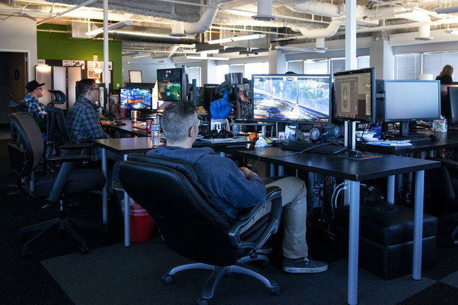

A friend of mine, who works as a graphics engine programmer for Psyonix, took me on a tour of the Psyonix headquarters!

First off, I was ecstatic getting the chance to experience what it's like working for a video game company, how the people are, and what opportunities there is for me to learn as well as the opportunities for me help a company I admire.

### Episodes I, II, II: The prequel trilogy

When people mention "Rocket League" I think the gnarly video game with cars and soccer.

When people mention "Psyonix" I think "Who?", but not anymore.

I first heard of Psyonix (as in the company name, I knew about Rocket League) when my friend started working for them. I did some research and never realized some of the people who worked there were the reason why I loved playing Unreal Tournament when I was younger. (Psyonix helped create the "Onslaught" game design and implementation which I had a blast playing online and occasionally on LAN at the military base my father was working at) I applied for certain positions, but I knew I wasn't qualified, but willing to learn what they had to offer if the opportunity arose. (It didn't, but eagerly working on my own development otherwise for another chance perhaps?)

### Episodes IV, V, VI: The original trilogy

The Psyonix headquarters is located in downtown San Diego, near Seaport Village and the Santa Fe Station.

`Need to finish this, out eating!`

### Episodes VII, VIII, IX: The sequel trilogy

Visiting a video game company headquarters definitely inspired me on what I want to do.

> I want to work for a video game company not only because I love games at the most simplest gesture, but games give a spectrum of emotions to people which I want to help create.

Thank you for reading if you've gotten this far. It's not everyday I get to be vulnerable and express my drive to work for video game companies.