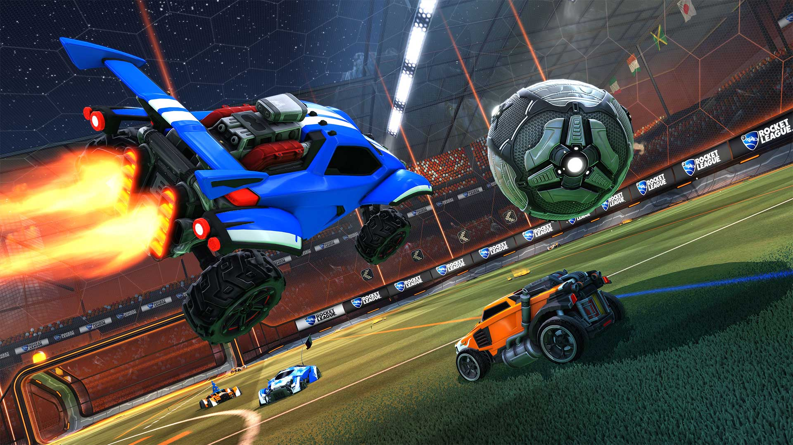

---
# Icon is a rocket ship
title: 🚀 The journey to Psyonix!
subTitle: First time visiting a video game company headquarters!
category: "career"
cover: AvatarSir.jpg
---

A friend of mine, a Graphics Engineer for Psyonix, took me on a tour of the Psyonix headquarters!

First off, I was ecstatic getting the chance to experience what it's like working for a video game company. Questions arose! How is the employee culture like? What conflicts do they face together and what tools do they use to handle their conflicts so the company and the user base can be satisfied? What opportunities are there for me with this company?

### ✨ Episodes I, II, II: The prequel trilogy

When people mention "Rocket League" I used to think...

`The video game that's soccer, but with rocket-powered cars right?`

When people mention "Psyonix" I used to think...

`Who is Psyonix?`

My thoughts have changed since then and I'm glad I took it upon myself to do some research and be immersed in the video game company. Rocket League is more than just a game, it's a culture. Psyonix is more than just a company, it's a community.

I first heard of Psyonix when my friend started working for them. I did some research and never realized some of the people who worked there were the reason why I loved playing Unreal Tournament when I was younger. (Psyonix helped create the "Onslaught" game design and implementation which I had a blast playing online and occasionally on LAN at the military base my father was working at) Through observing these two games I noticed the similarities between them, but I believe the one that carries well across both is the vehicle aspect. When we're controlling the vehicle, we want to go fast, we want to rocket high towards the Z-axis collision area (assuming there is one). This is what made the game mode of "Onslaught" super fun and this is the very core mechanic in Rocket League that became a game recognized by many.

Now, onto the journey being at the headquarters.

### 🌟 Episodes IV, V, VI: The original trilogy

The above picture is from the Twitter of <a href="https://twitter.com/PsyonixStudios" target="_blank">@PsyonixStudios</a>.

The Psyonix headquarters is located in downtown San Diego.

If you're going to be visiting, be aware you will need to sign an NDA (ELI5 (Explain like I'm 5): A NDA is a Non-Disclosure Agreement, what the company shows you, you're not supposed to show anyone else.) & with that that's all I can say!

Just kidding, thought I need to be reserved with my word choices.

Where do I begin? The whole experience was amazing. I got to meet some amazing people, unaware of what they're doing, but putting pieces together of what they are doing. The employee atmosphere felt like I was just walking around my childhood neighborhood saying "Hello!" and whichever phrase have you. The set up of the work areas were no joke, it felt like somewhere I wanted to work at 100%.

### ⭐ Episodes VII, VIII, IX: The sequel trilogy

I've applied to Psyonix before, but I wasn't ready for what they needed me to fill in which was understandable. Everyday I'm learning and I find the beauty of learning engaging. Visiting a video game company headquarters definitely inspired me on what I want to do. 

> I want to work for a video game company not only because I love games at the most simplest gesture, but games give a spectrum of emotions to people which I want to help create.

Thank you for reading if you've gotten this far. It's not everyday I get to be vulnerable and express my drive to work for video game companies, especially Psyonix.