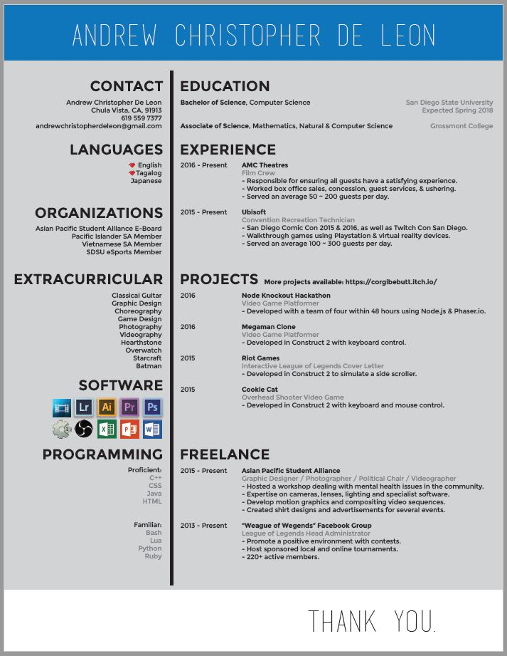
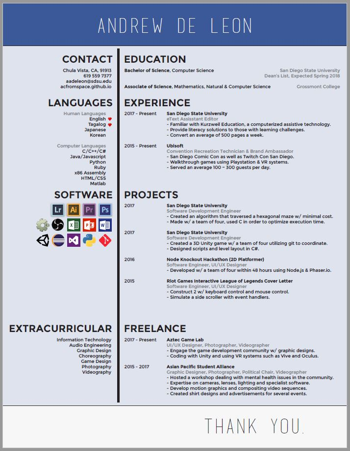
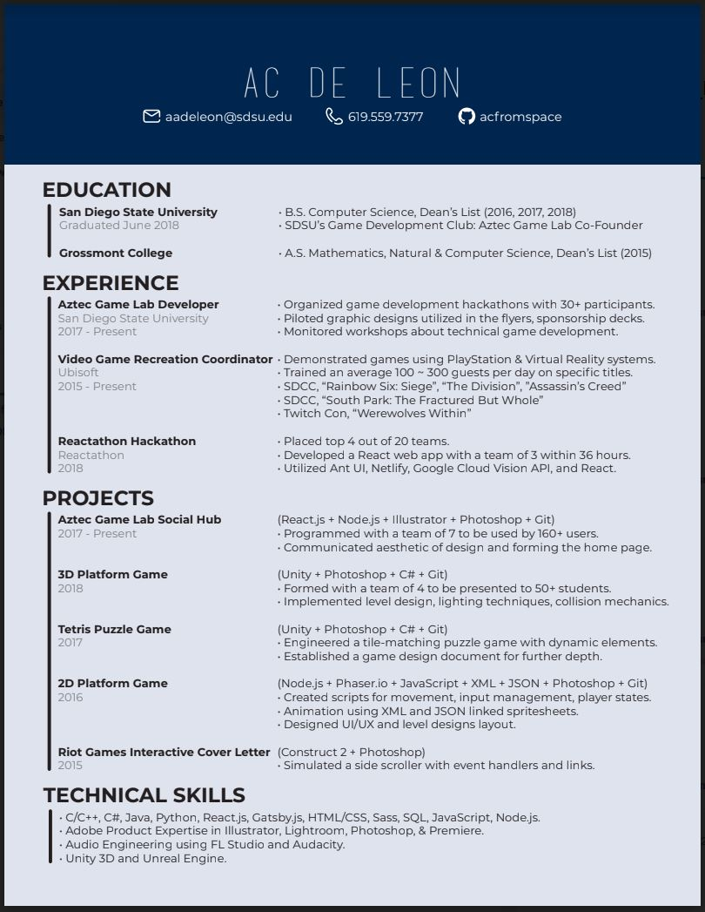
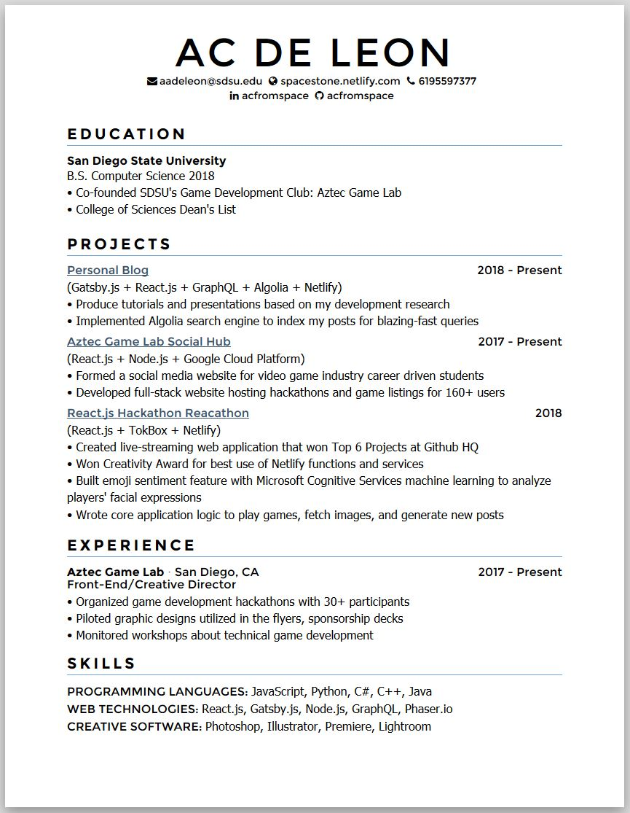

---
# Icon is a "Microscope"
title: 🔬 Finding the resume for me...
subTitle: "Work harder. Better. Make faster. Stronger. Evolution never over."
category: "career"
cover: AvatarAbathur.jpg
---

I've always used Adobe Illustrator, a creative software used to create documents, to format my resumes. I had hoped to create an advantage by using Adobe Illustrator opposed to other candidates using the typical Microsoft Word/Google Docs formatting. Soon I learned what worked for me and what didn't work for me.

> Throughout this blog post, I explain my timeline through crafting resumes and why I made the changes I did.

### First Resume

This is the first time I used Adobe Illustrator for creating a resume. 

When making my resume I thought "Why not have fun with it, include everything that I thought was cool." If you wish not to cringe, please stray your eyes away from this beautiful, but blinding image.

### Seventh Resume

Fast-forward in time, this is the seventh resume.

1. Changed my name from `"Andrew Christopher De Leon"` to `"Andrew De Leon"` to be simple to remember.
2. Changed my email preference to the university given one from `"andrewchristopherdeleon@gmail.com"` to `"aadeleon@sdsu.edu"` to show I'm integrated with academia.
3. Combined languages to both spoken and programming languages to have less to read.
4. Updated my `experiences`, `projects`, `freelance` to more "computer" related occupations.
5. Updated the `software` section to showcase more icons.
6. Went from a lighter blue to a darker blue.

### Tenth Resume

This was the final version until I did the transfer to the new format which I show right after this one.

> Fun fact: I chose blue because the color is associated with trust and loyalty.

1. Updated the background colors of the resume from 3 to 2, simplicity.
2. Cut down the sections from 8 to 4, simplicity again.
3. Made an emphasis on keywords knowing that computer filter programs go through several resumes and will most likely cut you off if you don't include specific keywords for their occupation posting.
4. Quantitative, instead of saying "several", say "20". This shows reliability.
5. Cut off the `"Thank you"` towards the bottom, the reader already knows you're saying thank you by them reading your resume.

### Present Resume

This is the resume format I am using now.

If you'd like to see my updated resume please click <a href="https://resume.creddle.io/resume/ayjgtizt9n7" target="_blank">here</a>!

I switched to <a href="http://creddle.io/" target="_blank">creddle.io</a>, a free resume builder, is because of several reasons.

1. Editing within Adobe Illustrator does give you creative freedom, but there's a flaw within the program. **One cannot use Illustrator to make hyperlinks.** There are several work arounds, but they're tedious to perform. With creddle.io it's simply built in.
2. In today's age, PDFs are admired, but sometimes when colleague and even recruiters ask if they may see my resume. Instead of them being forced to download something, I can simply give them a link. With creddle.io, it works equivalent to a git repo, commit your changes and when you're ready to publish, simply push and the link, without having to change anything, will be updated!

In conclusion, I will be using creddle.io for it's ease of access and ease of use.

> You don't have to have a hard time crafting something, it should be simple and easy to use that produces excellent results.

