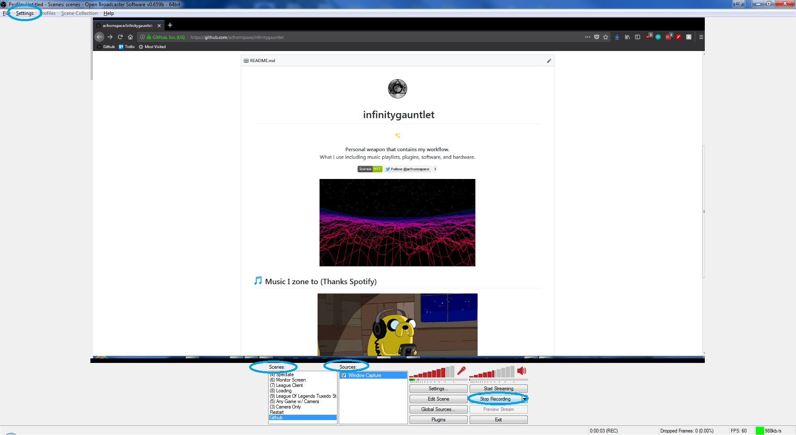
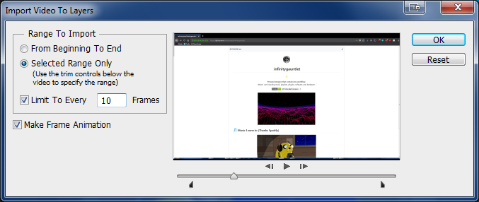
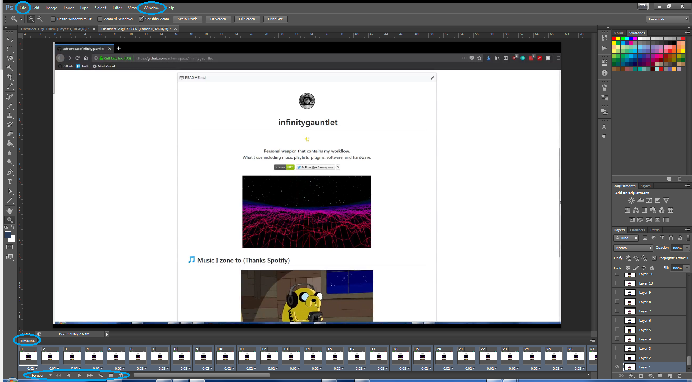
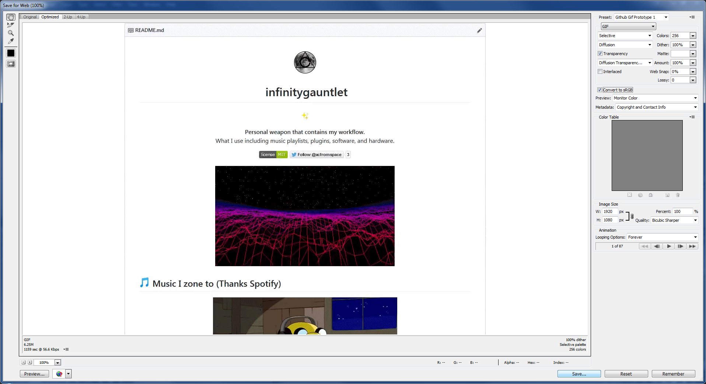
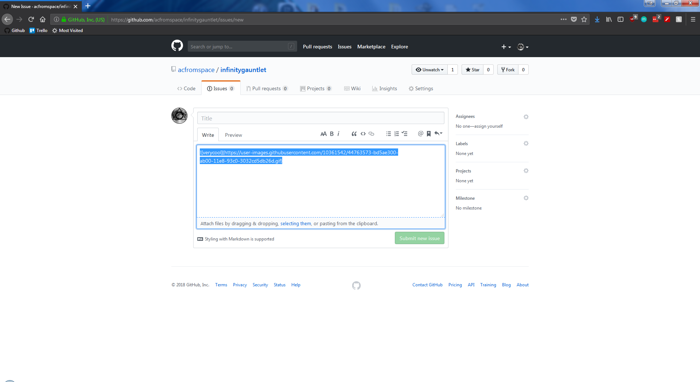

---
# Icon is a "Woman Technologist"
title: 👩‍💻 How to make quality .gifs!
subTitle: Buff up your README.md or be the meme master.
category: "tutorial"
cover: AvatarValeera.jpg
---

## <span role="img" aria-label="Sparkles">✨</span> Sing-Along Tutorial Video

<iframe width="540" height="315" src="https://www.youtube.com/embed/MwPQtC-Es58" frameborder="0" allow="autoplay; encrypted-media" allowfullscreen></iframe>

## <span role="img" aria-label="Sparkles">✨</span> Set-up

For this tutorial you should have these:

```txt
Software Programs needed (or equivalent):
Open Broadcaster Software (OBS)
Adobe Photoshop (PS)

Other:
Something cool to record!
```

**Note:** Make sure you have empty space on your main drive due to PS caching information!

## <span role="img" aria-label="Sparkles">✨</span> Tutorial

You want to record whatever you want to make a .gif out of with OBS at preferably 1080p settings, so open up OBS!



```txt
Fix the settings to 1080p:
> Settings
> Video
> Resolution

Create the environment to record:
> Scenes
> Add Scene
> Sources
> Window Capture
> Start Recording!
```

**Note:** Be sure to know where your video files are going! Mine go to my "Videos" folder automatically.

Open up PS:

```txt
Importing the video to layers:
> Go to the top left
> File
> Import
> Video Frames to Layers

Fix options in the window that pops up:
> Range to Import

View the timeline:
> Go to the top
> Window
> Timeline
```



Ideally you want your .gifs to look fluid, high quality, and not take so much space. Personally I do "Limit to Every 10 frames" and select my beginning and end.



```txt
Selecting all the frames in the timeline and changing speed:
> Go to the bottom
> Click first frame
> Hold [SHIFT] while clicking last frame
> Right click on any of them
> Change time delay (Normally I choose 0.04 seconds)
```

0.04 seconds is what feels good to me, but feel free to test out what you think is better for you! Test out the .gif by pressing the play and stop buttons right below the timeline.

```txt
Making the .gif (Finally!):
> Go to the top left
> File
> Save for Web...
```



A window should appear here with plenty of options at the right side and will let you know how big the file will be (byte wise) at the bottom left.

When satisfied, simply save!

## <span role="img" aria-label="Sparkles">✨</span> Now what?

If the file is less than 10 MB, you can abuse the GitHub issue "drag and drop" files. Copy the URL that GitHub converts it to and tada! (Much easier than other image platforms that reduce the quality, you know who I'm talking about.)



If the file is not less then 10 MB, you'll have to link it from your repo or shorten down the size because that is a ton of space! (Personally, I link it from my repo so I can get those high quality .gifs)

Distribute your ".gif"ts to the world!

<!-- Putting in markdown did not contain the .gif, so using HTML instead -->

